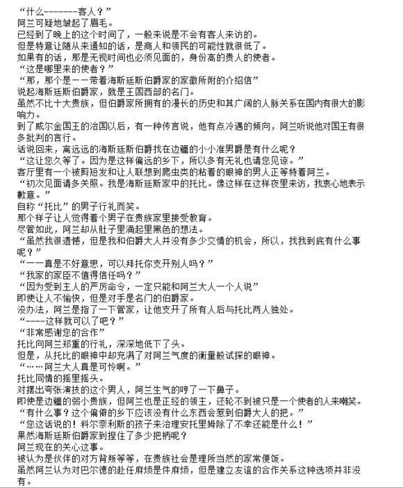
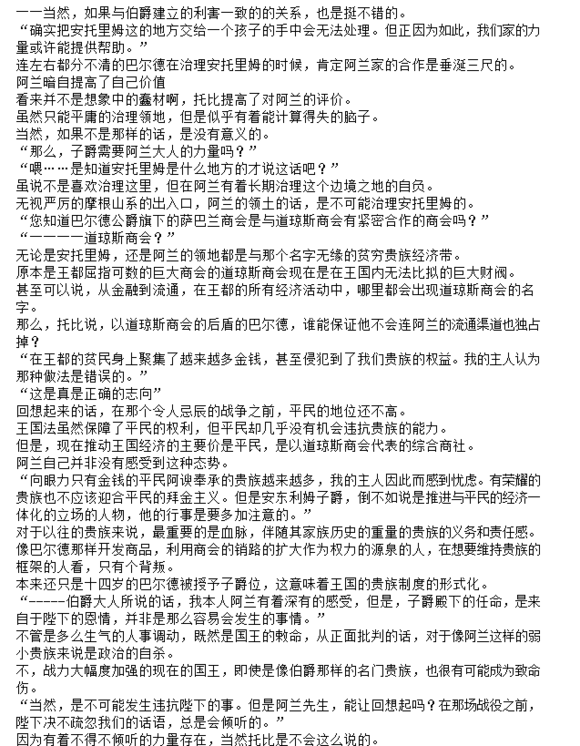
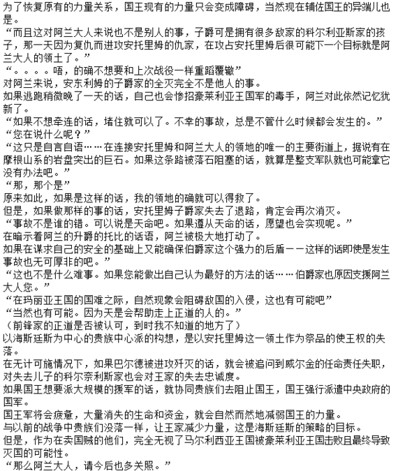

# 12.马哥特怀孕  

---  

> 收录于[百度贴吧](https://tieba.baidu.com/f?kw=异世界转生骚动记)  
> 原贴地址<https://tieba.baidu.com/p/5728811743>  

---  

被不期而遇的三人视线所暴露的阿尔福德，再次对巴尔德的影响力产生了复杂的感情。  
如果自己不是希尔克的父亲，而是作为兰多夫侯爵的当主做出判断的话，还真是不能无视所谓的巴尔德的这个存在的啊  
如果把真心不想把女儿交给他的想法抛弃的话，倒是会有种自己被那个狡猾的国王抢了一步的感觉。  
不管是本人期望的情况下，今后会产生以巴尔德为中心的骚动，并为以此为锲机那个的国王想要利用这件事是无需置疑的。  

虽然只有一个十二岁的少年，本来是应该作为伯爵家的嫡子来学习的年龄，但他所背负的东西实在是太大了。  
——不，实在大过头了。  
他实在远超过作为有能力的男人这种评价的级别，甚至可以是有能力到非常危险的地步。  
即使考虑到将来的兰多夫侯爵家的得失，也只能说是巴尔德的少年，只能说是有着很多不确定因素的危险人物。  
“……这只不过是宫廷的传闻，而且只不过是我个人的推测而已。希望你们能以这个为前提听我说这件事。”  
对于这件事阿尔福德所知道的信息并不是那么多。  
其一是对于盛芬尔王国的婚姻废弃的蕾切尔公主，阿伦西亚公国的向其提亲，而国王却拒绝了。  
另一件是从从盛芬尔王国回来的巴尔德被邀请到了雷切尔的茶会的事。  
当知晓了在公主和巴尔德曾开心地聊天过的事的时候，希尔克用泪汪汪的眼神向巴尔德发送了抗议。  
这是一个被称为安东利姆子爵叙任的这次人事。  
最后是安托里姆子爵的人事提拔这件事  
一般来说，是一种等同于惩罚的人事，现在，即使是批判的贵族之间，也会与遗漏出一些满同情的话语。  
——反过来说，可以说，如果不被批评的话，要使巴尔德升爵位的话，只要这一种方法，也可以说这是一种非常绝妙的方法。  
不管如何在沈芬尔王国进行了怎么样的外交，光凭这一点想要给予领地的话就会引起各种各样的反对。  
正因为是谁都不想做的边疆最前线，所以巴尔德提拔才会是作为笑话而被带过。  
但是，在那个边疆，只要做到谁都能知晓的明显功绩的话————当然，下一个奖励会成就会是成为伯爵的。  
并且考虑到将来如果巴尔德继承了哥伦利亚斯家的话，那么即使是新的边疆伯爵也就不会奇怪了。  
配给王女一点也不逊色的夫婿就这样诞生了。  
谁都不注意到有这种可能性，这样的印象战略的意义上，选择了安托里姆子爵的国王的政治嗅觉，让人觉得脊梁变冷。  
而且那个腹黑的国王，仅仅这样还不满足，而且还瞄准着一石二鸟的国内改革。  
真是个腹黑到极点的糟老头啊  
"------正因为如此，所以我才会觉得那个糟老头想要把你安插进王室。虽然从年龄和阶级等级来说貌似都是无谋的事情。但是那个国王就是偏偏会做出这样事情的男人，而且你------也是一个纯正的麻烦制造者，所以这种猜想反而更加准确”  
“真是麻烦的男人啊”  
用厌烦的声音小声嘟囔的同时，阿加莎却深深地靠在我的背上。  
“真是的”  
为了自己的事情正想埋头苦恼的巴尔德，阿加莎毫不留情地追击。  
“----------你也是一样的”  
“唔。。”  
真是个麻烦的事啊。  
就像瞎编的故事一样，一个是异常有远见且异常腹黑的君主，另一个是拥有这波澜壮阔人生的英雄少年，一切都以奇迹般的偶然才能拼凑出来的事态啊。  
这绝不是偶然的。在历史活动的时候必定会发生的奇迹般的事，阿加莎知道了像这样的奇迹一样的偶然事在历史变动的时候必定会发的。  
或者说是更应该表扬被这样的男人吸引了的希尔克小姐的眼力吗?，还是要感叹不幸呢?……。  
“……太过分了！把巴尔德当政治的工具什么的一样！而且陛下认为公主是什么啊？”  
听到阿尔福德的话，希尔克激动地喊着。  
但是，这种愤怒并不是从来自于理性，而是来自感情的东西，在亲生父亲阿尔福德一目了然。  
因为出生于十大贵族的一员，兰多夫家的希尔克是不可能不理解那种程度的政治策略的。  
“大概认为这是有着这样的价值的吧。我到时觉得是不值得的说。”  
如果是国王女婿的边疆伯爵的诞生的话，说不定一个搞不好，就有可能会替换了十大贵族。  
虽然是一件非常令人厌恶的事情，但阿尔福德也不能不承认威尔金的政治手腕了。  
岂止如此，对拥有特立维尔公国问题的阿尔福德来说，也会变成是一个不可或缺的同盟者。  
“那么父亲大人是赞成陛下的想法吗？”  
“在王族的婚姻中，你觉得会有臣下会为此胡思乱想吗？而且，根据我的直觉，雷切尔殿下也省油的灯”  
“————我最讨厌爸爸了！！”  
“哇啊啊啊啊啊啊啊啊啊啊”  
希尔克头也不回的跑出了房间。  
对于超出预料的女儿的反击，阿尔福德瞬间变成了白色，慢慢风化崩塌掉了。  
无论经历过多少次，被女儿说最讨厌他这件事还是那么的痛心疾首。  
“不追她好吗？”  
阿加莎用恶作剧而笑着盯着巴尔德。  
“……这种的时候，到底要怎么回答才好呢？”  
如果被允许自恋的话，希尔克肯定是作为一个女人对自己抱有好感的。  
但是，作为哥伦布伯爵家的独生子的话，并没有选择她为妻子的选择项。  
如果在巴尔德入赘兰多夫家的话，说不定可以，但另外两个人是不可能原谅那样的事的。  
阿加莎看着显得很有孩子气巴尔德的反应，眼神慢慢变得尖锐。  
即使说谎也没关系的去安慰希尔克，或者为了公主的情义而远离希尔克，这样选择也都是存在的。  
连一点都无法选择而困惑的巴尔德，无法感受到背负着未来王国的英雄的风格。  
嗯，幸好大小姐也并不是完全没有脉了。  
一副晴朗的表情，阿加莎说了这么一句话。  
“现在只把自己的心弄清楚。即使与你爱着女性之间有多大的障碍，现在的你也是有能力将其变为现实的。我的主人”  

另一方面，连脸颊上的眼泪都没擦掉的希尔克，逃进自己房间后终于意识到自己的恋慕之情在不知不觉中与贵族身份的事产生了矛盾而发出哽咽。  
“。。。。。我真是个讨厌的人啊”  
为什么塞伦娜和塞丽娜被求婚的时候，明明能坦率地祝福，但是在雷切尔公主的婚事中，会有这么大的动摇呢？  
那是不是因为别的，就是因为是的正妻的位置还空着的想法而来的。  
平民且虚荣心低的那两个人是不能胜任在伯爵家的正妻的位置的。  
觉得在无意识中这样判断的自己是一种残忍且丑陋的生物。  
明明以为是朋友啊  
明明一直以来想要的朋友啊，能袒露真心的挚友啊。  
但是自己的心中某处却在俯视她们，认为她们是不能胜任正妻的侧室，把自己沉浸在此等的优越感中。  
直至身份比自己还高的蕾切尔公主付出水面成为对手，这或许就是天罚吧？  
索性因罪恶感把什么都抛弃掉，或许就不会这么痛苦了啊。  
“笨蛋。。。。为什么直到现在才。。。”  
不管怎么想都看不到能与巴尔德结合的未来。  
尽管如此，我还是喜欢上了巴尔德。  
不，从很久以前就开始这份恋情。  
只是至今为止的自觉，自己是因为害怕面对而一直在逃避。  
但是已经意识到了的现在，自己怎么办才好，没有答案。  
侯爵大小姐的希尔克摇头。  
答案的话就出来了。快点放弃就好了。把所有的都忘掉。  
即便这样，自己还是不想放弃。  
——我不想把巴尔德交给雷切尔。  
“。。。。谁。。。。能。。帮帮我啊。。。。。”  
对于无法实现的希望而烦恼的希尔克的哽咽，直到深夜也没有消失。  

匆匆忙忙地从骑士学校毕业的巴尔德，作为家臣而采用的只有布鲁克斯和尼尔森两人。  
另外，从兰多夫家成为安托里姆家的家臣的阿加莎小姐，还有从萨巴兰商会介绍的共计3名会计师，这些就是巴尔德的全部家臣了。  
并且安托里姆领地残留的王宫官僚也多多少少有些，还有就是科尔奈利斯家的支援也是已经决定好的事情了。  
当然，以泰洛斯为首的曾经的同伴们，肯定会协助自己的。  
“。。。。为什么会变成这样。。。。”  
想当初离开了故乡，决定进入王立骑士学校的时候，在王都想要得到新的相遇和生意的发展的梦想好像变成很要远的记忆了。  
不知道是哪里出错了，现却成为了有用领地的子爵。  
还想着再多体验一下学生的放纵生活，或者体验一下那酸甜的青春啊。  
这样的生活过程突然被跳过，变成了拥有两名婚约者以及被家臣包围的情况，又有谁能预想到呢？  
“啊！我看到了哦！巴尔德大人”  
不知何时不再称他为“巴尔德少爷”的塞尔恩，从马车上探出身子，露出了笑容。  
对她来说，对一直认为弟弟一样的少年产生恋情，即使身份不同却被求婚，经理了这般变化无常的人生后，就在眼前的故乡对她来说意义深刻。  
在很熟悉的森林的绿色对面等待着的，即使不是马哥特也不是泰洛斯。  
“哦~\~~\~~咦！大将啊~\~~\~~\~~\~” 
在马上摇着大个子的身体，而出现的是吉尔科。  
在巴尔德的记忆中，美食家吉尔科的应该会稍微有点胖，但是清爽的腹部周围，以及瘦下来脸颊，是相当努力地减肥到节制的效果吧。  
不愧是专业的雇佣兵就是不一样，巴尔德改变了对吉尔科的评价。  
但是，这也只是一段时间————。  
“真的好想念你啊~\~大将啊~\~~\~~\~”  
“呀啊~\~~\~！”  
对着想要压死巴尔德一般跳起飞身过来的的吉尔科，巴尔德不经的尖叫起来。  
虽然在这段时间巴尔德的身高变高了不少，但是要接住吉尔科的巨体的话，还是太过渺小了。  
“太过分了，在大姐身边，别人出门帮忙都不会被阻止，只有我一个人一直被流在大姐身边，我真不知道我到底什么时候就会坏掉了啊~\~”  
“好了好了，让开啊”  
虽然用身体强化勉强接住了吉尔科，但是却被吉尔科的巨体压在下面不得动弹的巴尔德发出了简短的命令。  
嘿咻，嘿咻，塞尔恩用它纤细的双手拼命的想要拉开吉尔科，但是在吉尔科的巨大的体重面前丝毫没有作用。  
就像是小孩子对着拿不起来的玩具奋斗着一样，不由得被这种场景所治愈心灵的巴尔德却被吉尔科越抱越紧。  
“拜托了，请不要丢下我啊！我什么都要做！下次一定要带我到安托里姆！”  
“到底发生了什么啊”  
“大姐她欺负我啊。。。被欺负的要死掉了，但是大姐却控制到绝对不会死的程度来欺负我，就像大将你所说的，大姐她是彻头彻尾的S啊！”  
就像是拥有巨大身体的孩子般，不停的颤抖着，吉尔科向巴尔德不断诉说着自从巴尔德他们离别后所过着的严酷的日子。  
那个内容就连塞尔恩她都觉得太可怜，可怜到不得不默许着她抱着巴尔德不放。  
“啊啊……好的，好的。我也有打算向吉尔科来帮忙保护安托里姆啦……”  
“哎！真的吗？就当是约定了哦？”  
这就可以了吗？你还是历战的佣兵吗？虽然想这么说，但在了解到每天在母亲超常的威胁下生活，会是的多么的肉体和是精神，以我的经历而已，我无法不想从心底感到同情。  
本来为了维持安托里姆治安，人才有多少也不够。  
对佣兵们拥有独特的人脉的吉尔科，是建立有效性的防卫体制是非常有用的人才。  
“——当知道大将被任命为安托里姆子爵时的大姐头……真是很可怕死啦！当大将被派到盛芬尔王国的时候虽然也很可怕，不过，这一回都觉得马尔利西亚王国要灭亡了的程度啦！”  
“你还真能让这样的她老实下来，真厉害啊”  
国王的无理要求暂且不说，将马哥特这个无法控制的非人类作为对手还真是非常险恶啊。  
虽然巴尔德相信父亲是绝对不会对母亲放任不管的，但是只有这次真的担心父亲能不能管得住母亲。  
只要有那个想法的话，那个母亲可是能轻而易举的杀死国王的啊。  
如果母亲不是战士，而是选择了暗杀者的道路的话，现在大陆的国王没有影武者，任何事情都办不了吧。  
无敌战神简直就像是为母亲准备的语言一般。（（（此处无敌战神是瞎编的，原文是什么安得切阿布鲁，不知道啥意思）））  
“挂掉了---我是这么认为的，本来就算拼死努力也是不可能阻止大姐头的啦，说实话，我这次真的对伯爵是刮目相看了”  
“为啥突然提到父亲啊？”  
“大姐头在心爱的男人面前也会软下来--仅此而已啦，就算是神也不会预想的阻止大姐头的竟然是爱情”  
和好不容易平静下来的吉尔科一起，马车前进到了科尔内利亚斯的宅邸，巴尔德因为知道了意外的内幕而惊讶不已。  

玛格特怀孕的消息以惊讶的速度传遍了科尔奈利斯家。  
看来这个太过喜欢恶作剧的母亲，不只没告诉巴尔德，甚至连家里其他人都没有说。  
听说领主继承儿子成为了危险土地的领主，因此而蒙上了沉重空气的科尔奈利斯家这被这个消息整个变换了气氛。  
为了能让年龄超过30多岁的马哥特的顺利生产，新的床的购买和饮食的重新评估等的不合时宜的骚动充满了科尔奈利斯家。  
为庆祝自巴尔德诞生以来的嫡子的诞生，储藏的麦酒甚至被发给了所有的领民，所有人都被染上了祝贺的色彩。  

（让她叫我“欧尼桑”吧……但是“欧尼酱”也难以舍弃啊。）  
虽然是一个独生子，不过是有一个叫塞尔恩的姐姐，但是却能得到弟弟或妹妹，巴尔德也和家臣一起沉浸于各种不同的幻想中。  
特别期待妹妹的诞生的雅晴的妄想，实实在在的侵蚀着巴尔德的精神。  
在同一个银发上戴着一双彩色眼睛的可爱的幼女，用口齿不清的话语叫我“欧尼酱”。  
然后像小狗一般地啪塔啪塔跟着后面，“跟我玩吧？”如果被说了这样的话，我就会有理性崩溃的自信。  
“……巴尔德先生，您的表情很邋遢啊。”  
沉浸在某个遥远的世界里，像是望着遥远的天空般的样子，塞尔恩拧了下巴尔德的侧腹部把他拉回了现实。  
“对不起，对不起。但是，我一想到将会有个弟弟或妹妹的话，这个也想做，那个也想做，想象就变得停不了了。”  
“虽然我也是有都是的哥哥姐姐，不是不能明白那个心情……”  
但为什么呢？总感觉到什么地方的有邪念。  
塞尔恩并不知道。在雅晴在的世界里，有着“小妹妹”和“俺妹”等具有代表性的特殊嗜好。  

——也许是因为意外的新家庭的诞生，塞尔恩和塞丽娜的婚约几乎没有抵抗力，就被父母接受了。  
“如果两个人能接受的话，没有理由反对”  
“彼此相爱的话，无论是谁都会祝福的。事到如今，也不需要为了家名而讨好我们了所。”  
对一夫一妻的鸳鸯夫妇来说，意外的很善解人意，巴尔德因为终于安心而大泄一口气。  
“谢谢你。老实说，我还担心妈妈是不是会生气的。”  
如果伊格尼斯再迎接一个妻子的话，马哥特会有什么反应我连想都不敢想。  
因为那肯等会成为伊格尼斯的人生的最后一天。  
“……塞尔恩你真的能接受这样吧？”  
以防万一说讨厌塞尔恩的话，首先要把切掉“巴尔德”的百分之一作为补偿吧，一边坚定了这样的心理准备，玛格特一边问道。  
“如果说真心的话，我还是讨厌这样的”  
马哥特的眼神瞬间变得尖锐起来，右手在无意识中向腰间的剑伸去。  
但是幸运的是，在马哥特拔出剑塞尔恩之前继续说出了那句话后的语句。  
“但是像巴尔德那样的男性我一个人独占是不可能的。不，如果是我一个人的话一定会妨碍他的命运的。”  
在塞丽娜的商才和希尔克的兰多鲁夫侯爵家的支持，还有国王的信任，只要失去任何一个，巴尔德可能就会失足，甚至失去了生命。  
如果只是一个普通的伯爵家的长子的话，也许就不需要那样的力量了，但在一切意义上如论如何都要把巴尔德牵扯进波澜壮阔人生的命运的安排下，使得他离平静的人生越来越远。  
“所以，我觉得爱巴尔德大人，能够互相合作的女性是有必要需要更多的。当然，我没有打算让给巴尔德大人的第一的位置。”  
直到几年前，巴尔德还只是一个很能干的小孩子而已。  
在他东搞西搞之间就成为了子爵，还被交付了一个叫安托里姆的危险地带做领地。  
反而现今想要回到牧歌般的悠闲生活中这种想法更不可能。  
肯定会发生某种事情。  
甚至考虑到地政学性的环境，就连发生真正的战斗的可能性很小都没办法说。  
“……塞尔恩你肯定会成为一个好媳妇的吧”  
马哥特带着像是在看亲生女儿般温柔的眼神，微笑了起来。  
“我能做的事情只有这些。”  
虽然对女仆的工作没有不满，但在巴尔德的辅佐的意义上，别说是塞丽娜，甚至连阿加莎也比不上。  
但是，对于巴尔德来说，这是比任何人都更了解巴尔德的习惯和爱好的塞尔恩的，她无微不至的关心和爱护，就像是空气一样是生命中不可缺少的一部分。  
“没有那样的事——塞尔恩对我的帮助是非常大的”  
“巴尔德大人……”  
“哎呀哎呀，在父母面前上演爱情戏了”  
不知不觉进入了一种很好的气氛，被玛格特指出后，巴尔德的脸染上了羞耻颜色。不过，塞尔恩好像有点坏了心情。  
“我明白你们不是闹着玩的了。但是——即使是真心的，兰德尔夫家的还是放弃吧。“  
“……即使是真的，也是吗？”  
如果是平时的母亲的话，是绝对不会说的台词。巴尔德因为这句话而困惑不已  
这是出自一个极端讨厌歪曲自己的意志的母亲的话。  
“那个姑娘所背负的东西比你想象的还要重。没有背负力的人伸出手的话，这只能是让彼此变得更加不幸。”  
蒙蒙维尔公国的黑暗很深，自己想要跳进黑暗的丝绸，会知道今后用自由意志行动是多么困难。  
那是作为十大贵族拥有巨大力量的阿尔福德侯爵也不例外。  
特列表维尔公国的黑暗很深，对于自己想要跳进黑暗的希尔克来说，今后用自由意志行动有多困难可想而知啊。  
那是作为十大贵族拥有巨大力量的阿尔福德侯爵也不例外。  
虽然是马哥特喜欢的类型的少女，但是她所背负东西却是比雷切尔公主更麻烦的。  
“。。。希尔克是我的好友”  
“你做朋友玩的话倒是也没关系。但是，要娶那个女孩儿的话，有可能会把这个国家卷入战争，或者将最坏情况会与马尔利西亚王国为敌人。我想说的就是这样。”  
不过，玛格特不发出声音的笑着。  
巴尔德的规格是不可能安宁于在安托里姆这个边疆的。  
绝对会变成很辛苦的，所以为了以防万一，先警告一下，但是总觉得儿子会与特列表维尔的动乱扯上关系。  
马哥特的直觉告诉她，儿子那会引起骚乱的英雄只相肯定会如此的。  
“如果他搞是外遇的话，就跟我商量吧。因为我会让他后悔出生为男人的。”  
这句话让巴尔德和伊格尼斯的下体一凉。整个人缩了起来。  

“这是怎么搞的啊，让至今的辛苦全变白费了啊”  
在桌子周围盘旋走来走去的初老男人，一边嚼着大拇指一边轻轻低语着。  
男人的名字叫阿兰·福尔卡克。  
安托里姆子爵领土西边的小准男爵领，位于其旁边的是布拉德福德子爵领土。  
在摩根山系的严峻的山峦和豪莱利亚王国边境之间的安托里姆子爵领的咽喉上，对安托里姆子爵领来说是一个不可或缺的物资转播据点。  
阿兰因贿赂了王室的直辖领的安托里姆的代官，以独占流通渠道，获得了巨大的利益。  
想要尽可能早一点回去，想从这么说的最前线的边疆返回王都的历代代官，为了得到王宫人事的工作资金，都非常欢迎阿兰的贿赂，反对的人一个都没有。  
但是，如果不是代官，真正的领主来赴任的话，情况就会改变。  
成为新的安托里姆子爵的巴尔德子爵能够坦率地接受阿兰的贿赂的可能性无限的低。  
本来对从领地获得收入的领主来说，因贿赂而被独占流通渠道，这根本就是本末倒置。  
而且巴尔德子爵，是围绕着福尔卡克准男爵领西的大领主布拉德福德子爵的亲情，而且是盛芬尔王国王太子妃特蕾莎的好友。  
如果做得不好，反而可能会导致阿兰的被东西夹击，从而失去自己领地的流通渠道的主导权。  
“可恶！本以为我的机会终于到了……没想到被这个臭小子全部搅黄了！”  
通过贿赂而获取资金，然后用这笔钱升爵至男爵，最后离开这里在王都附件获得一块领地，这就是阿兰的梦想。  
话说回来，阿兰这个人既没有领地经营的才能，也没有上敢上战场赚取战绩的勇气。  
也就是说，这意味着阿兰的梦想在巴尔德赴任的同时就已经破灭了。  
“为什么我要遭受如此待遇啊！为什么！”  
阿兰气的把桌上的花瓶用力摔在地上的时候，随从在旁边小声的通知他有访客来访。  

